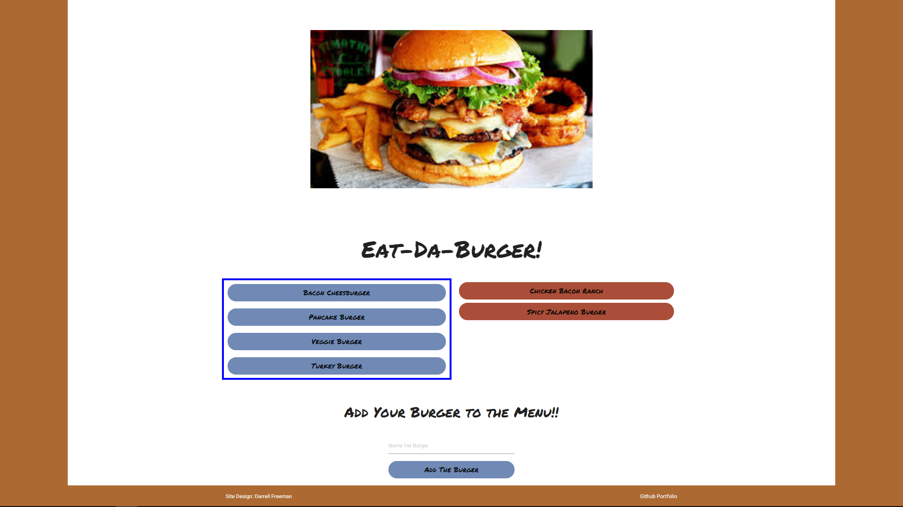

### Eat Da Burger! - A menu customization app.
***

- Author:  Darrell Freeman
- Date: June 8, 2017
- Tools Used:  HTML5, CSS, Materialize, Javascript, JQuery, Node.js, Express, MySQL, Handlebars 
NPM's (express, body-parser, mysql, method-override, express-handlebars)

## Description

This application demonstrates a simple full stack application with a front end implemented with HTML/CSS and elements from the Materialize framework and the backend implemented with Node.js and Express. HTML templating is done with the help of Handlebars.

  <strong>Landing Page</strong>

  <kbd>
  
  </kbd>

Click the "Go" button to take the survey.
 
 
 

  <strong>Survey Page</strong>

  <kbd>
  
  </kbd>

Answer the survey questions, and hit the "Submit" button when ready.
 
 
 

  <strong>Results Page</strong>

  <kbd>
  
  </kbd>

                                                      

The user may enter any burger name to add it to the menu. This also adds the new burger entry into the MySQL database. The initial burger entry is added as *available* on the menu and placed on the left side of the screen. The user may then eat any burger by clicking on it, which moves it into the adjacent column and updates its status accordingly in the database.
